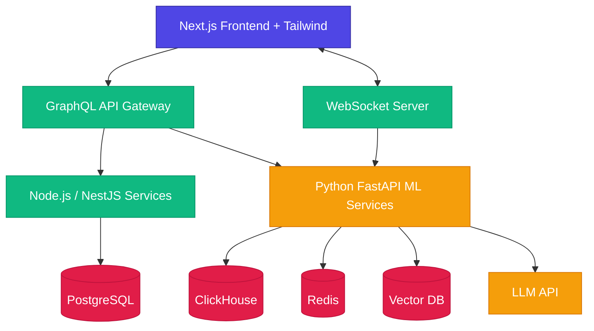

# PROJECT ANALYSIS & DEVELOPMENT STRATEGY
## Cricket Intelligence AI Platform (CIAP)

### 1. Complete Product Understanding

CIAP is an AI-powered cricket analytics ecosystem that combines historical data analysis, real-time match tracking, machine learning predictions, and explainable AI conversational interfaces. The platform targets IPL cricket (2008-present) with a long-term vision of expanding into a global sports intelligence platform.

**Core Value Proposition:** Unlike traditional scoreboards that show raw numbers, CIAP explains *why* a team is predicted to win, and lets users query this intelligence through natural language conversation.

**8 Core Modules:**
1. Historical Match Analytics (H2H, venue, team history)
2. Team Intelligence Engine (composite team ratings)
3. Player Intelligence Engine (individual performance metrics)
4. Match Prediction Engine (pre-match ML probabilities)
5. Live Prediction Engine (real-time dynamic updates)
6. Tournament Predictor (Monte Carlo playoff simulations)
7. Explainable AI Engine (SHAP-based reasoning)
8. AI Cricket Assistant (RAG-powered conversational interface)

### 2. Architecture Summary

**Tech Stack:**
- **Frontend:** Next.js, Tailwind CSS, Zustand, React Query, Recharts/D3.js
- **Backend:** Node.js (NestJS), GraphQL (Apollo), WebSockets
- **ML/AI:** Python (FastAPI), XGBoost, LightGBM, SHAP, LangChain
- **Databases:** PostgreSQL, ClickHouse/TimescaleDB, Redis, Pinecone/Weaviate
- **Infrastructure:** Docker, Kubernetes (EKS), GitHub Actions, Terraform

### 3. Development Strategy

**Pragmatic Approach for V1:** Build a monorepo with clearly separated frontend, backend, and ML services. Use SQLite/PostgreSQL locally, simulate live data with historical replays, and deploy to Vercel (frontend) + Railway/Render (backend) for rapid iteration before scaling to full AWS infrastructure.

**Execution Sequence:**
1. Project foundation (monorepo, tooling, CI/CD)
2. Database schemas and seed data
3. Data engineering (historical IPL data ingestion from Cricsheet)
4. ML model training and evaluation
5. Backend APIs (REST + GraphQL)
6. Frontend UI (Next.js dashboard)
7. Explainable AI (SHAP integration)
8. AI Chat Assistant (LangChain + RAG)
9. Live match simulation
10. Testing and deployment

### 4. Risk Analysis

| Risk | Impact | Likelihood | Mitigation |
|:-----|:-------|:-----------|:-----------|
| Historical data quality issues | High | High | Validate Cricsheet data rigorously, build cleaning pipeline |
| ML model accuracy < 60% | High | Medium | Ensemble models, extensive feature engineering, time-series CV |
| LLM API costs escalate | Medium | High | Cache frequent queries, use smaller models for simple intents |
| Live data feed latency | High | Medium | Redis caching, WebSocket multiplexing, graceful fallbacks |
| Prompt injection in AI chat | High | Medium | Input sanitization, strict system prompts, output validation |
| Scope creep beyond IPL V1 | Medium | High | Strict phase gates, defer multi-sport to Phase 9 |

### 5. Technical Dependencies

**External Services:**
- Cricsheet.org (historical ball-by-ball data, free)
- OpenAI/Anthropic API (LLM for chat, paid)
- Auth0/Clerk (authentication, freemium)

**Core Libraries:**
- Frontend: next, react, tailwindcss, zustand, @tanstack/react-query, recharts, framer-motion
- Backend: @nestjs/core, @nestjs/graphql, apollo-server, socket.io, prisma
- ML: pandas, scikit-learn, xgboost, lightgbm, shap, fastapi, langchain

### 6. Development Sequence (Phases 1-13)

Phase 1 → Project Foundation (repo structure, tooling)
Phase 2 → System Architecture (folder structure, shared libs)
Phase 3 → Database Layer (schemas, migrations, seeds)
Phase 4 → Data Engineering (ETL, Cricsheet ingestion)
Phase 5 → ML Layer (train/evaluate 4 models)
Phase 6 → Prediction Engine (APIs for match/tournament prediction)
Phase 7 → Backend APIs (auth, users, teams, players, analytics)
Phase 8 → Frontend Development (dashboard, prediction, teams, players)
Phase 9 → Explainable AI (SHAP reasoning, confidence)
Phase 10 → AI Assistant (LangChain RAG chat)
Phase 11 → Live Match Intelligence (WebSocket streaming)
Phase 12 → Testing (unit, integration, API, ML, UI)
Phase 13 → Deployment (Docker, CI/CD, monitoring)

### 7. Infrastructure Requirements

**Development Environment:**
- Node.js 20+ (LTS)
- Python 3.11+
- PostgreSQL 16
- Redis 7
- Docker Desktop

**Production Environment (Future):**
- AWS EKS (Kubernetes)
- AWS RDS (PostgreSQL)
- ElastiCache (Redis)
- S3 (Data Lake)
- CloudFront (CDN)

### 8. Missing Requirements (Identified Gaps)

- No specific API versioning strategy documented
- No rate limiting specification for public APIs
- No specific error code taxonomy
- No data retention/deletion policy (GDPR considerations)
- No A/B testing framework for ML models in production
- No specific WebSocket reconnection strategy

### 9. Recommended Improvements

- Add comprehensive API error response standardization (RFC 7807)
- Implement feature flags for gradual rollout of AI features
- Add model A/B testing infrastructure from Phase 5
- Implement circuit breaker pattern for external API dependencies
- Add structured logging with correlation IDs across services
- Consider GraphQL subscriptions instead of separate WebSocket server for unified API layer
