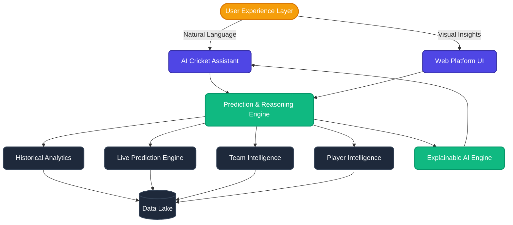
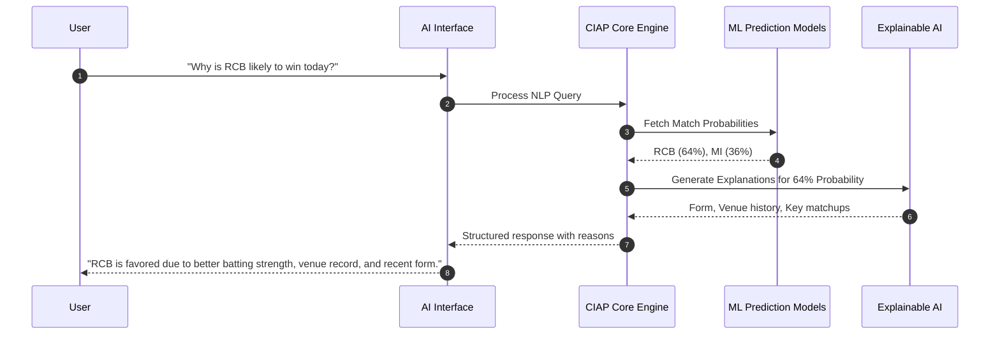

# 🏏 Cricket Intelligence AI Platform (CIAP)

> **Also known as:** Cricket Oracle AI, CricketGPT, IPL Intelligence Engine, CricVision AI

**CIAP** is a next-generation intelligent cricket analysis platform. Moving beyond traditional scoreboards and simple win predictors, CIAP acts as a virtual cricket analyst. It is capable of understanding, analyzing, explaining, and predicting cricket events—all accessible through an intuitive conversational interface and a dynamic web dashboard.

---

## 🎯 Core Objectives

- **Predict Match & Tournament Outcomes:** Leverage historical and real-time data to forecast winners.
- **Explainable AI (XAI):** Provide clear, data-backed reasons for every prediction.
- **Player & Team Intelligence:** Deliver deep, multi-faceted analysis of team strength and individual player form.
- **Conversational AI:** Allow users to query insights naturally (e.g., *"Why is RCB favored today?"* or *"Compare MI and CSK"*).

---

## 📐 System Architecture & Flow

The platform is built upon four intelligent layers that take raw cricket data and transform it into explainable, actionable insights.

### 1. Intelligence Layers Flow
```mermaid
flowchart LR
    classDef layer fill:#312E81,stroke:#4338CA,stroke-width:2px,color:#fff,rx:8px;
    classDef data fill:#065F46,stroke:#047857,stroke-width:2px,color:#fff,rx:8px;
    
    subgraph Raw Data
        D1[(Historical Data)]:::data
        D2[(Live Match API)]:::data
        D3[(Player Stats)]:::data
    end

    L1[Layer 1: Data Collection<br>Ingestion & Sync]:::layer
    L2[Layer 2: Data Processing<br>Cleaning & Feature Eng]:::layer
    L3[Layer 3: Prediction Engine<br>ML Models]:::layer
    L4[Layer 4: AI Reasoning<br>XAI & NLP]:::layer
    
    Raw Data -.-> L1
    L1 --> L2
    L2 --> L3
    L3 --> L4
```

### 2. High-Level Platform Architecture


### 3. User Interaction Journey


---

## 🧩 Core Modules

| Module | Description | Example Output |
| :--- | :--- | :--- |
| **Historical Analytics** | Analyzes previous IPL seasons, venues, and head-to-head records. | *MI vs CSK last 10 matches breakdown.* |
| **Team Intelligence** | Calculates aggregated team strength (Batting, Bowling, Fielding). | *RCB Overall Rating: 88* |
| **Player Intelligence** | Deep dive into individual player metrics (Runs, SR, Avg, Econ). | *Virat Kohli - Recent Form: Excellent* |
| **Match Prediction** | Pre-match probability forecasting based on historical & current data. | *RCB Win Probability: 62%* |
| **Live Prediction** | Real-time, continuous outcome updating based on current match situations. | *Updated Win Chance: 74% after over 15.* |
| **Tournament Predictor**| Long-term forecasting for Playoffs and Champions. | *Champion Chances: RCB (26%), MI (22%)* |
| **Explainable AI** | Generates human-readable context for every numerical prediction. | *Reasons: 1. Batting 2. Venue 3. Form* |
| **AI Cricket Assistant** | The NLP interface for users to chat with the platform data directly. | *"Who will score the most runs today?"* |

---

## 🚀 Long-Term Vision

Transforming CIAP from a dedicated IPL predictor into a holistic **Sports Intelligence Ecosystem**. 
Future integrations will scale the platform to cover International Cricket, World Cups, Champions Trophy, and global T20 leagues. 

CIAP sits at the intersection of Data Science, Real-Time Analytics, and Conversational AI, redefining how fans, analysts, and fantasy players experience the game of cricket.
