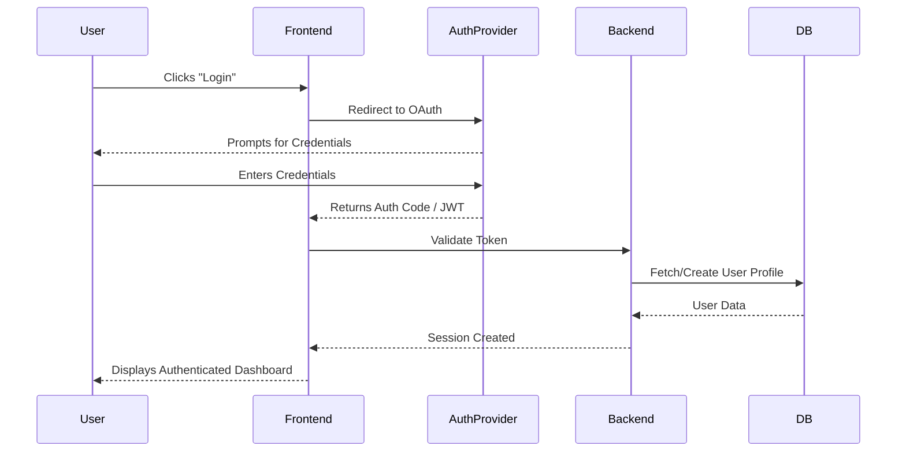
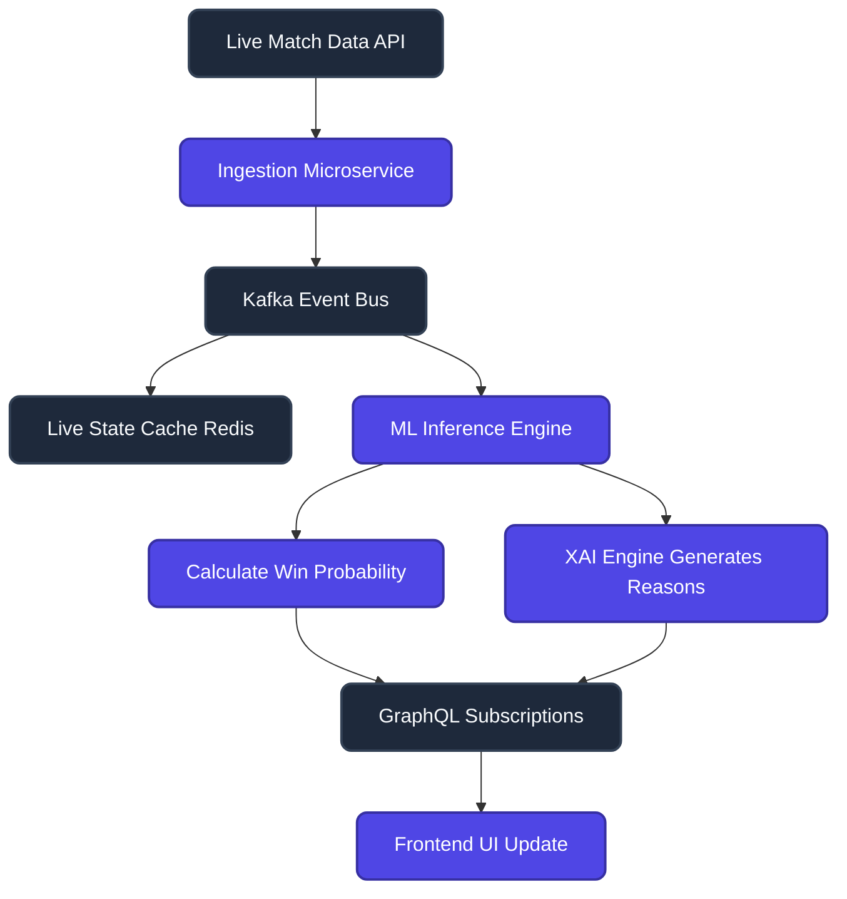
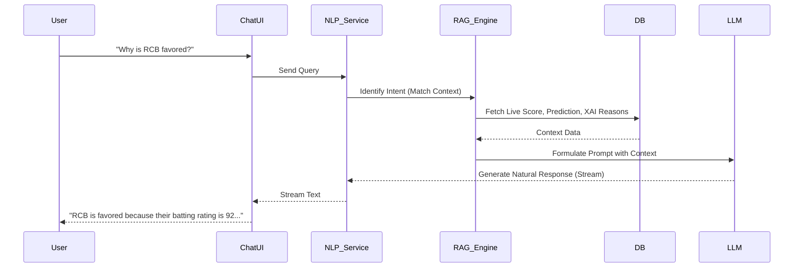
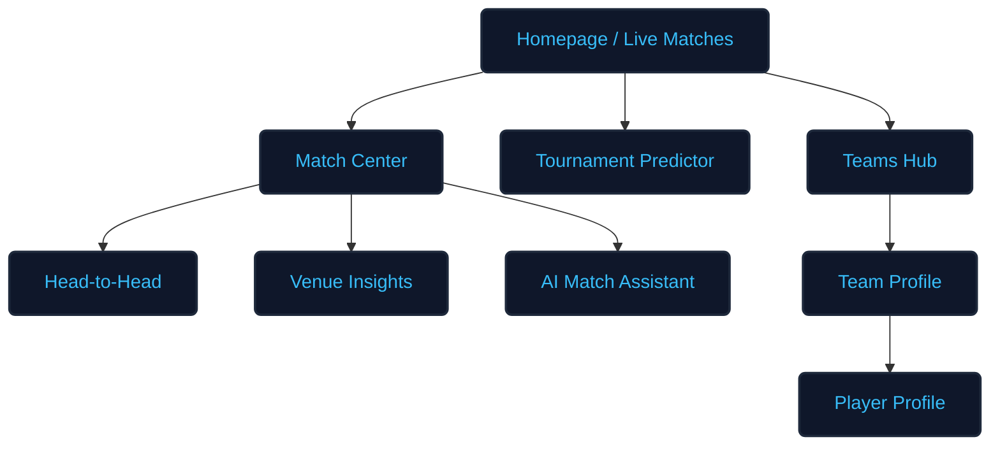

# Application Flow & User Journeys
## Cricket Intelligence AI Platform (CIAP)

### 1. Complete User Journey
The user journey in CIAP is designed to be frictionless, moving seamlessly between visual dashboards and conversational AI.
1. **Onboarding:** User lands on the homepage, views live matches and top-level predictions.
2. **Exploration:** User navigates to a specific Match Center.
3. **Deep Dive:** User reviews XAI reasons, team strengths, and player matchups.
4. **Interaction:** User opens the AI Assistant sidebar to ask contextual questions.
5. **Conversion:** User registers/logs in to save favorite teams or access premium fantasy insights.

### 2. Authentication Flow

### 3. Prediction Flow & Live Match Flow

### 4. Chatbot Flow (Conversational AI)

### 5. Tournament Prediction Flow
- Runs nightly after match completions.
- **Input:** Current points table, remaining schedule, team strength ratings.
- **Process:** Monte Carlo simulations (10,000+ iterations) to determine probability distributions for Top 4 qualification and Championship win.
- **Output:** Cached JSON stored in Redis and served to the "Tournament Predictor" dashboard.

### 6. Analysis Flow (Team/Player Intelligence)
- User selects a Player (e.g., Virat Kohli).
- Frontend queries GraphQL API for `playerStats(id)`.
- Backend aggregates historical data from ClickHouse.
- Backend calculates "Recent Form" using a weighted moving average of the last 5 matches.
- UI renders charts (Run distributions, Strike Rate trends).

### 7. Error Handling Flow
- **API Failure:** UI displays graceful fallback (e.g., "Live odds temporarily unavailable").
- **LLM Timeout/Failure:** Chatbot responds with a standard safety message ("I'm analyzing complex data right now, please try again in a moment.")
- **Data Desync:** Client-side polling validates local state against server state hash every 30 seconds; forces a hard refresh if out of sync.

### 8. Navigation Flow

