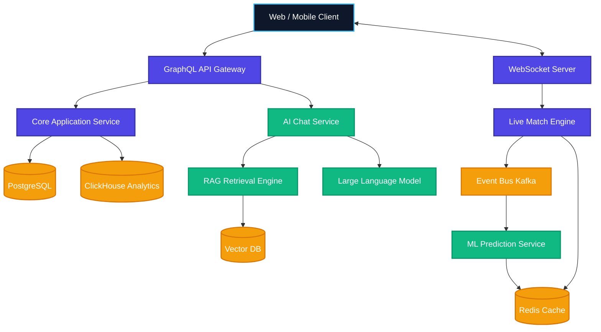

# System Design Document
## Cricket Intelligence AI Platform (CIAP)

### 1. High-Level Architecture
CIAP utilizes a multi-tier, event-driven microservices architecture. It is designed to handle high-velocity data during live cricket matches while simultaneously serving low-latency ML predictions and natural language AI responses to end-users.

### 2. Low-Level Architecture & Microservice Architecture
- **API Gateway Service:** Handles routing, rate limiting, JWT validation.
- **Ingestion Service:** Connects to 3rd party cricket APIs, normalizes JSON payloads, publishes to Kafka.
- **Match Service:** Manages schedules, team rosters, and metadata (CRUD operations).
- **ML Inference Service:** Consumes live match events, runs XGBoost/LightGBM models, outputs probabilities and feature importance (XAI).
- **AI Chat Service:** Manages session history, orchestrates LangChain pipelines, interacts with OpenAI/Anthropic APIs.

### 3. API Architecture
- **REST APIs:** Used for internal service-to-service communication and webhooks.
- **GraphQL:** Exposed to the frontend for efficient, tailored data querying.
- **WebSockets:** Maintained per client for pushing live score ticks and prediction shifts in real-time.

### 4. AI Service Architecture
- **Intent Classifier:** Routes user queries (e.g., "Live Score" goes to rule-based fetch, "Why is RCB winning" goes to XAI reasoning).
- **RAG Pipeline:** Converts queries to embeddings, searches Vector DB for historical stats, retrieves current live match state from Redis, constructs prompt context.
- **Streaming Generator:** Streams LLM output back to the client via Server-Sent Events (SSE).

### 5. Data Flow Architecture
- **Historical Data:** Batch ETL jobs run nightly -> Stored in PostgreSQL (relational) and ClickHouse (analytical).
- **Live Data:** Webhook received -> Ingestion Service -> Kafka Topic (`live-ball-events`) -> ML Service -> Redis Update -> WebSocket Broadcast -> Client UI.

### 6. Scalability Architecture
- **Stateless Pods:** All Node.js and Python FastAPI services run as stateless Docker containers orchestrated by Kubernetes (EKS/GKE).
- **Auto-scaling:** Horizontal Pod Autoscaler (HPA) configured to scale based on CPU utilization and Kafka lag metrics.
- **CDN:** Cloudflare caches static assets and Next.js frontend bundles.

### 7. Security Architecture
- **Network:** VPC with private subnets for databases and internal services. Only the API Gateway is exposed to the public internet via an API Gateway/Load Balancer.
- **Data:** Secrets managed via AWS Secrets Manager / HashiCorp Vault. No PII is sent to external LLMs.

### 8. Database Architecture
- **PostgreSQL:** User accounts, subscription states, team profiles, match schedules. (ACID compliant).
- **ClickHouse:** Columnar storage for billions of historical ball-by-ball records. Optimized for aggregations.
- **Redis:** In-memory store for active match states, current win probabilities, and active user chat sessions (TTL set to 24 hours).
- **Vector DB:** Pinecone/Weaviate for semantic search of cricket rules, venue histories, and qualitative reports.

### 9. Caching Architecture
- **Edge Caching:** CDN for static files.
- **API Caching:** Apollo Server query caching for non-live data (e.g., historical match results cached for 1 hour).
- **Data Caching:** Heavy aggregations from ClickHouse are cached in Redis for 5 minutes during active use.

### 10. Queue Architecture
- **Apache Kafka:** Central nervous system.
  - Topics: `ball-by-ball`, `match-state-updates`, `prediction-updates`.
  - Guarantees exactly-once processing for analytics and at-least-once for UI updates.
- **Message Queues:** RabbitMQ/BullMQ used for background tasks (e.g., sending push notifications, batch tournament simulations).

### 11. Deployment Architecture
- Automated CI/CD via GitHub Actions building Docker containers, scanning for vulnerabilities, and pushing to Amazon ECR. 
- Deployment to EKS clusters using Helm charts, adopting a Blue/Green deployment strategy to prevent downtime.
